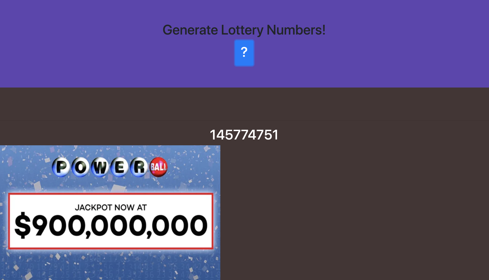

# Lottery
the lottery number generator should pick 9 random numbers between 0-9 and output as one number. As an example: 886563264. this number will display in the random-number div. Then when a user clicks again, the code will create a new row with the latest number at the top.

